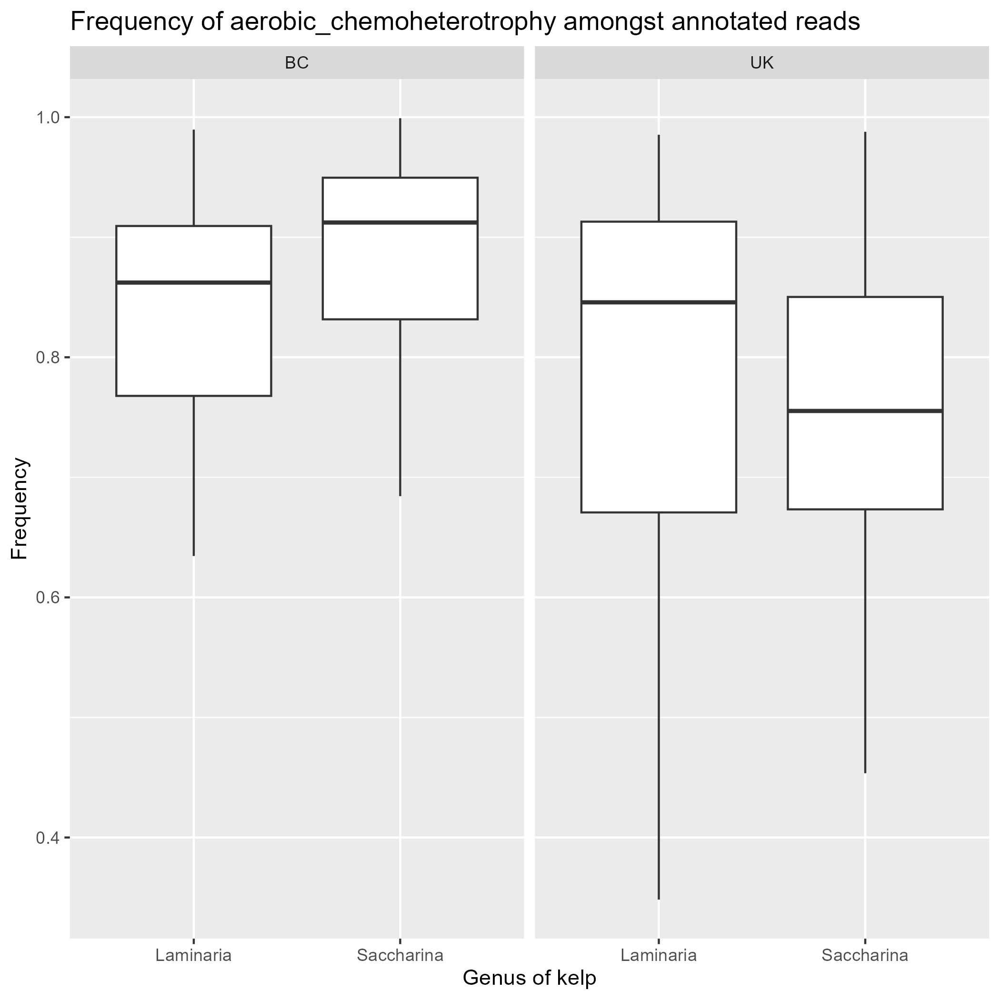
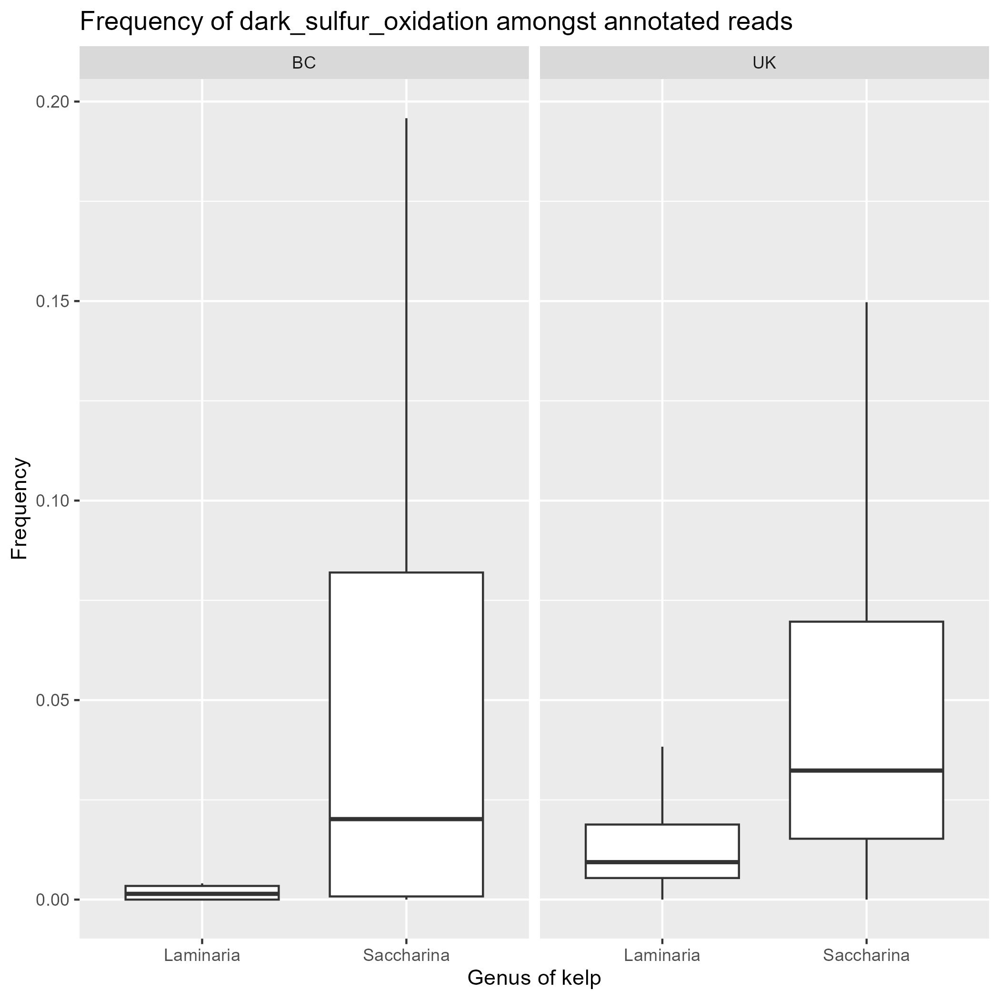
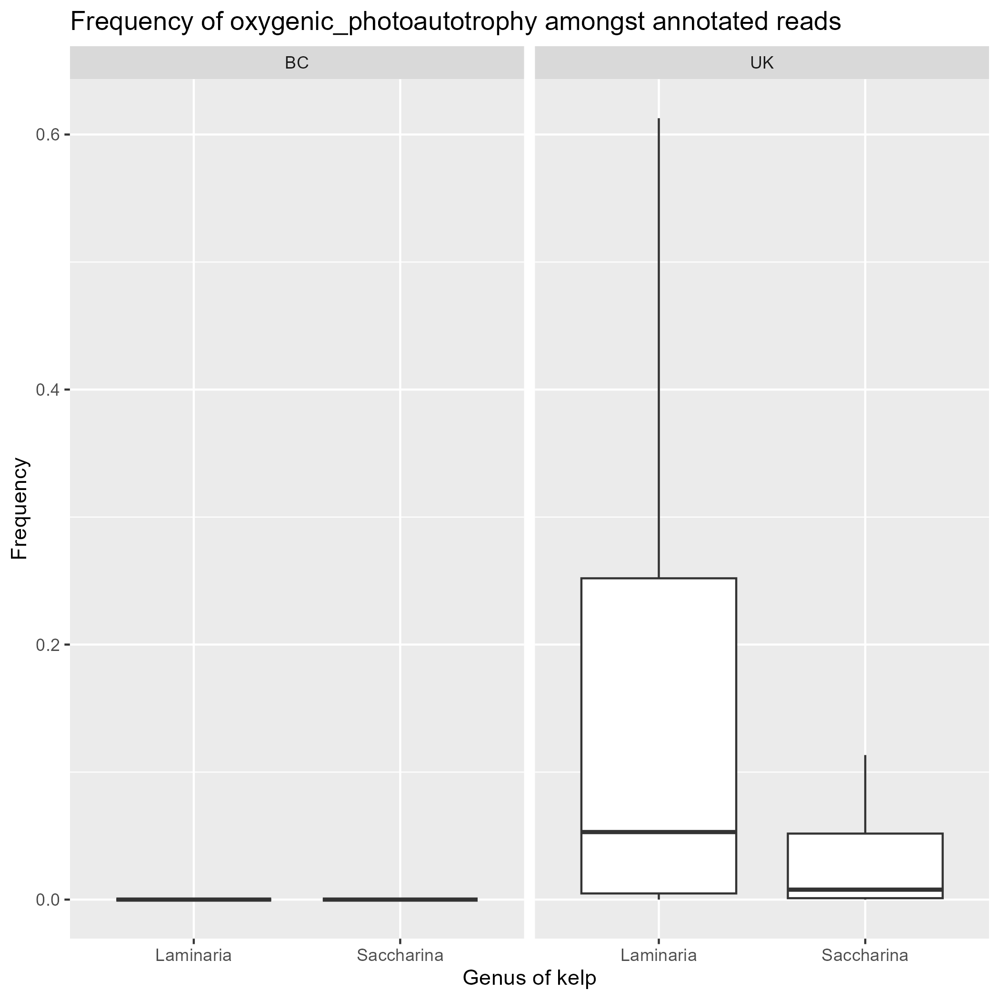
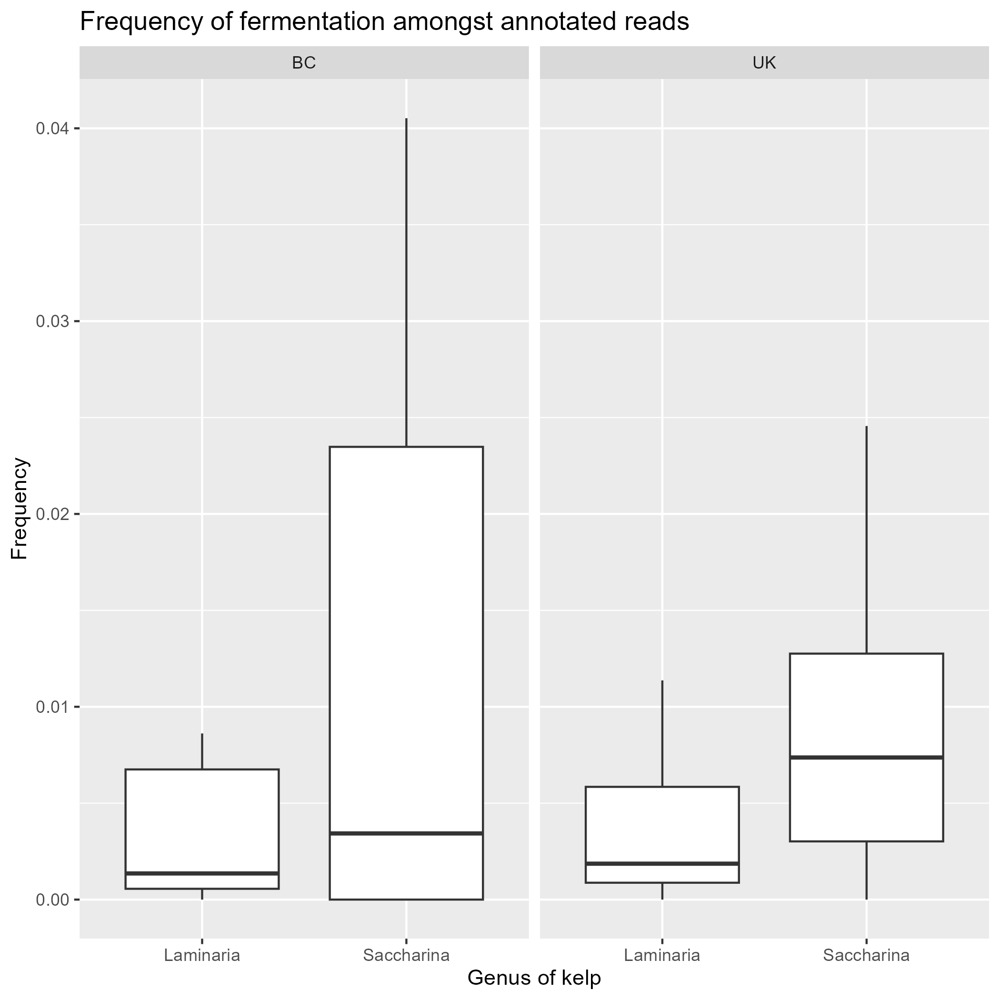

```{r setup, include=FALSE}
knitr::opts_chunk$set(echo = TRUE)
```

## Hypothesis

(A)	That microbiomes associated with *S. latissima* and *L. hyperborea* share a common functional profile in BC and the UK, respectively.
(B)	That these functional profiles are the same on the West Coast as in the UK.


## Initialize necessary packages

```{r, message=FALSE}
## start by loading necessary packages

library(phyloseq)
library(tidyverse)
library(vegan)
library(plyr)
library(qualpalr)
library(ggpubr)
library(dplyr)
library(data.table)
library(biomformat)
library(readr)
library(rstatix)
```

## Clean data and combine datasets

First we will load in the data from Lemay et al. (2018). As a part of this we need to extract some metadata that is encoded in the sample names.

```{r}
lemay2018 <- readRDS("lemay2018_unfiltered_phyloseq.RDS")

newMeta = separate(as.data.frame(as.matrix(lemay2018@sam_data)), 
                              col="sample_id",
                              into=c("sample_id", "Sample"),
                              sep="-")


newMeta$Region = str_sub(newMeta$sample_id, -2,-1)
newMeta$genus= str_sub(newMeta$sample_id, 1,-3)
newMeta$Species = newMeta[,"Species"] = NA

lemay2018 = phyloseq(sample_data(newMeta),
                        otu_table(lemay2018@otu_table, taxa_are_rows = FALSE),
                        tax_table(lemay2018@tax_table))
```

Next we will import the data from King et al. (2022) and merge it with the Lemay data.

```{r}
## import king data
king2022 <- readRDS("king2022_unfiltered_phyloseq-2.RDS")

## add a variable to further specify where the data was collected
kingsubsam <- subset(king2022@sam_data, select = 
                       c("sample_id","Sample", "Region","Species"))
kingsubsam = separate(as.data.frame(as.matrix(kingsubsam)),
                      col= "Species",
                      into=c("genus", "Species"),
                      sep=" ")

#combining sample data into 1 table
SamData <- rbind(newMeta,kingsubsam)
# new phyloseq object with all the data 
taxa1 <-  read.table("Lemay2021_tax_noNAs_SILVAv138_16s.txt", header = TRUE, row.names = 1)

OTUs1 <- t(readRDS("seqtab_nochim_KingLemay.RDS"))

kelp_me = phyloseq(otu_table(OTUs1, taxa_are_rows = T),
                         tax_table(as.matrix(taxa1)),
                         sample_data((SamData)))
```

Now we can clean our combined dataset

```{r}
kelp_me <- subset_taxa(kelp_me,
                       domain != "Unassigned" &
                         domain != "Eukaryota" &
                         order != "Chloroplast"&
                         order != "Mitochondria")
#Add unfiltered sample read numbers in 
kelp_me@sam_data$sample_sums_unfiltered <- as.numeric(sample_sums(kelp_me))
#sort(as.numeric(sample_sums(kelp_me))) : Most samples > 1000,
kelp_me_high <- prune_samples(sample_sums(kelp_me) >= 1000, kelp_me)
#extracting OTUs and filtering low frequency ASV's 
otutab <- as.data.frame((as.matrix(otu_table(kelp_me_high@otu_table))))
otutab$asv_abundance <- rowSums(otutab)
#removing ASV's that occur fewer than 100 times in the dataset
otu.pruned <- subset(otutab, otutab$asv_abundance>100)
widthotu = ncol(otu.pruned)
otu.pruned <- otu.pruned[,-c(widthotu)]
#removing low freq samples 
ASVoccur = function(x){return(sum(x>0))}
otu.pruned$asv_occur_count = apply(otu.pruned,1, ASVoccur)
otu.highfreq = subset(otu.pruned, otu.pruned$asv_occur_count > 2)
otu.highfreq = otu.highfreq[,-c(widthotu)]
```

Finally we can de-noise and export this data for easy use in the future.

```{r}
## remove reads that are the result of sequencing errors
otu.clean <- mutate_all(otu.highfreq, funs(ifelse(. <5, 0, .)))

kelp_me_clean = phyloseq(sample_data(kelp_me_high),
                          tax_table(kelp_me_high),
                          otu_table(as.matrix(otu.clean), taxa_are_rows = TRUE))

kelp_me_clean@sam_data$sample_sums_filtered <- sample_sums(kelp_me_clean)

write_rds(kelp_me_clean, "kelp_me_clean.RDS")
```
## Import clean data

Import clean data, if necessary
```{r}
kelp_me_clean <- readRDS('kelp_me_clean.RDS')
```

## Post processing

```{r}
## remove samples with no specified region 
kelp_me_clean = subset_samples(kelp_me_clean, is.na(Region) == FALSE)
## rename region for later processing
names(kelp_me_clean@sam_data)[3] = "Location"
## add a new region field (either BC or UK)
assign_reg = function(x){ifelse(nchar(x)<3, "BC", "UK")}
kelp_me_clean@sam_data$Region = assign_reg(kelp_me_clean@sam_data$Location)
```

## SKIP IF FAPROTAX HAS BEEN RUN: find functional classifications

Now we must save the OTU and taxonomy tables as dataframes and export them to the biom format.

```{r}
tax.data = as.data.frame(kelp_me_clean@tax_table)
tax.data = rownames_to_column(as.data.frame(tax.data))
otu.clean = as.data.frame(kelp_me_clean@otu_table)
names(tax.data)[1] = "OTUID"
otu_biom = make_biom(as.data.frame(otu.clean))
write_biom(otu_biom, "kelpme_otu.biom")
write.table(tax.data,"kelpme_otu_metadata.txt", quote = FALSE, sep ="\t")
```


Next we format our taxa metadata using python, using the following code. 

```tools.py -i kelpme_otu_metadata.txt -v```

After doing this we can add this metadata to our otu table using the following command line code:

```biom add-metadata -i kelpme_otu.biom -o kelpme_tax.biom --observation-metadata-fp kelpme_otu_metadata.txt```

Then we run collapse_table.py to get the proportions of different functions in our sample using this command line code:

``` collapse_table.py -i kelpme_tax.biom -o kelpme_func.biom -g FAPROTAX.txt --collapse_by_metadata "taxonomy" -v -s kelpme_sub_tables --out_groups2records_table kelpme_groups2records.txt --out_group_overlaps kelpme_overlaps.txt --omit_unrepresented_groups --group_leftovers_as "unannotated_asvs"```

Finally, we must transform our output into a text file to easily import it back into R using this last piece of command line code:

```biom convert -i kelpme_func.biom -o kelpme_func.txt --to-tsv```

## Import functional annotations into R

Then we can import this back into R as follows, and add it to our sample data.

```{r}
## import functional annotation of lemay dataset
file_name = "kelpme_func.txt"
func_table = read.table(file_name, sep = "\t", row.names = 1)
## import sample names and append them to the table of functional annotations
func_header = scan(file_name, nlines = 2, what = character())[-c(1:7)]
names(func_table) = func_header
func_table = as.data.frame(t(func_table))
```

## Find number of ASVs in each sample that were annotated

To find the number of annotated ASVs in each sample we need to upload the annotation table from FAPROTAX and compare it to our OTU table.

```{r}
## use our counts of unannotated asv reads to find the number of annotated asv reads
func_table$annotated_asvs = kelp_me_clean@sam_data$sample_sums_filtered - func_table$unannotated_asvs

# save the number of columns in our table
metacols = ncol(func_table)
```

## Remove samples not from relevant kelp species

```{r}
## Combine the metadata from the original phyloseq file with the new functional annotation data
kelp_me_meta = as.data.frame(kelp_me_clean@sam_data)
func_table = cbind(func_table, kelp_me_meta)

func_table = subset(func_table, genus == "Laminaria" | genus == "Saccharina")
```


Now we will combine all these into a single table of functional annotations

```{r}
## before lengthening the table copy the number of annotated asvs to another column
func_table$annotated_asvs2 = func_table$annotated_asvs

## pivot longer to assign the occurence of each function to the sample it was measured in
func_table.long = func_table %>% pivot_longer(cols = c(1:metacols), names_to = "eco_function", values_to="function_abundance")


## calculate the relative abundance of each function in each sample
func_table.long$relative_abundance = func_table.long$function_abundance/func_table.long$sample_sums_filtered

## next summarise the data by function
func.sum = ddply(func_table.long, c("eco_function"), summarise, sum = sum(relative_abundance))

## sort the data by relative abundance
func.sum= func.sum[order(-func.sum$sum),]

## separate out the top 15 most common functions as well as the number of annotated reads in each sample
## the total number of annotated reads should be the most common "function" in each sample so we take the top 16 most common functions instead of the 15 most common
top.df = func.sum[c(1:17),]
top.df$place = "top_15"
```

## Plot the overall frequency of different functions

When plotting the relative abundance of different functions we will break the data down by species and region. We can see in the table below that there is a bias towards samples collected from *Saccharina* in samples from BC but not in the UK, so we will examine each of these pairs separately.

```{r}
func_table %>%
  with(table(genus, Region))
```

### Region

```{r}
for (f in top.df$eco_function){
  funcdata = subset(func_table.long, eco_function == f)
  funcy_plot = ggplot(funcdata, aes(x=as.character(genus), y = as.numeric(relative_abundance)))+
    geom_boxplot(outliers=FALSE)+
    facet_grid(.~Region, scales="free", space="free")+
    ggtitle(paste("Overall frequency of", f, sep = " "))+
    labs(y="Frequency", x="Genus of kelp")
  ggsave(paste0(f,"_by_region",  ".png"), plot = funcy_plot, path = "figures/overall")
}
```
### Location

```{r}
for (f in top.df$eco_function){
  funcdata_bc = subset(func_table.long, eco_function == f & Region == "BC")
  funcdata_uk = subset(func_table.long, eco_function == f & Region == "UK")
  funcy_plot_bc = ggplot(funcdata_bc, aes(x=as.character(Location), y = as.numeric(relative_abundance)))+
    geom_point()+
    facet_grid(.~genus, scales="free", space="free")+
    ggtitle(paste("Overall frequency of", f, sep = " "))+
    labs(y="Frequency", x="Location")
  ggsave(paste0(f,"_by_location_bc",  ".png"), plot = funcy_plot_bc, path = "figures/overall/data_by_location")
  funcy_plot_uk = ggplot(funcdata_uk, aes(x=as.character(Location), y = as.numeric(relative_abundance)))+
    geom_point()+
    facet_grid(.~genus, scales="free", space="free")+
    ggtitle(paste("Overall frequency of", f, sep = " "))+
    labs(y="Frequency", x="Location")
  ggsave(paste0(f,"_by_location_uk",  ".png"), plot = funcy_plot_uk, path = "figures/overall/data_by_location")
}
```

## Plot the frequency of different functions amongst annotated ASVs

When examining the most frequent functions in our samples we see an interesting trend where samples from the UK tend to have more annotated ASVs than samples from the West Coast.


To reduce this bias this we will calculate normalize relative frequency of the most common functions among the annotated ASVs by the number of annotated ASVs in a sample. Assuming that these are a representative sample of the overall functional profile of the population, this should help reduce this bias.

### Region

```{r}
func_table.long$relative_annotated_abundance = func_table.long$function_abundance/func_table.long$annotated_asvs2

for (f in top.df$eco_function){
  funcdata = subset(func_table.long, eco_function == f)
  funcy_plot = ggplot(funcdata, aes(x=as.character(genus), y = as.numeric(relative_annotated_abundance)))+
    geom_boxplot(outliers=FALSE)+
    facet_grid(.~Region, scales="free", space="free")+
    ggtitle(paste("Frequency of", f, "amongst annotated reads", sep = " "))+
    labs(y="Frequency", x="Genus of kelp")
  ggsave(paste0(f,"_by_region",  ".png"), plot = funcy_plot, path = "figures/annotated")
}
```

### Location

```{r}
for (f in top.df$eco_function){
  funcdata_bc = subset(func_table.long, eco_function == f & Region == "BC")
  funcdata_uk = subset(func_table.long, eco_function == f & Region == "UK")
  funcy_plot_bc = ggplot(funcdata_bc, aes(x=as.character(Location), y = as.numeric(relative_annotated_abundance)))+
    geom_point()+
    facet_grid(.~genus, scales="free", space="free")+
    ggtitle(paste("Frequency of", f, "amongst annotated reads", sep = " "))+
    labs(y="Frequency", x="Location")
  ggsave(paste0(f,"_by_location_bc",  ".png"), plot = funcy_plot_bc, path = "figures/overall/data_by_location")
  funcy_plot_uk = ggplot(funcdata_uk, aes(x=as.character(Location), y = as.numeric(relative_annotated_abundance)))+
    geom_point()+
    facet_grid(.~genus, scales="free", space="free")+
    ggtitle(paste("Frequency of", f, "amongst annotated reads", sep = " "))+
    labs(y="Frequency", x="Location")
  ggsave(paste0(f,"_by_location_uk",  ".png"), plot = funcy_plot_uk, path = "figures/annotated/data_by_location")
}
```

## Removing redundant functions

In our analysis it is now necessary to note that FAPROTAX classifies certain functions as nested within each other. For instance, all OTUs that were assigned aerobic chemoheterotrophy were also assigned chemoheterotrophy. In our results we can see this as several taxa have very similar frequencies to the taxa they are nested within.

 

Other examples of such nested phenotypes are:

- dark sulfur oxidation is nested in dark oxidation of sulfur compounds
- oxygenic photoautotrophy and photoautotrophy are nested in phototrophy

For further analysis then we will focus only on these nested functions as they provide the most specific information about the functional profile of these microbial communities. However, there are also functions which seem similar, both in their frequencies as well as their purposes, but are not nested within each another function. For instance:

 

as well as

 

We can now examine the overlaps tables for why this might be the case

```{r}
overlaps = read.table("kelpme_overlaps.txt", sep = "\t", row.names = 1, header = TRUE)

## first look at the overlap between dark sulfite and dark sulfur oxidation
print(overlaps["dark_sulfite_oxidation","dark_sulfur_oxidation"])

## next look at the overlap between photosynthetic cyanobacteria and oxygenic photoautotrophy
print(overlaps["photosynthetic_cyanobacteria","oxygenic_photoautotrophy"])
```

Then we can see that there is a total overlap between species assigned dark sulfite oxidation and dark sulfur oxidation, as well as between those assigned photosynthetic cyanobacteria and oxygenic photoautotrophy. We will then exclude dark sulfite oxidation and photosynthetic cyanobacteria from further analysis as they are redundant.

## A preliminary functional profile

Comparing the different functions present in our samples there is strong evidence for the presence of aerobic chemoheterotrophy across sites and samples. There is also some evidence for the presence of dark sulfur oxidation, oxygenic photoautotrophy, fermentation, and predation/parasitism (predatory_or_exoparasitic) at low levels in the UK.

     

## Comparing for Statistical Significance

Now we must check to see if these differences have statistical significance. First, because there is a difference in the frequency with which FAPROTAX annotates taxa across both regions and species, and because this correlates with similar differences in the frequency that traits such as aerobic chemoheterotrophy are annotated, it is fair to assume that there is a bias in the overall frequency that traits are annotated within our samples. For this reason, we will proceed looking at only the frequency of different traits amongst annotated taxa, assuming that these taxa are representative of the overall community. Later we will attempt to verify this assumption


We will check if the difference between the frequency of different traits in our preliminary functional profile are different on *Saccharina* and *Laminaria* the UK and in BC.

```{r}
sig_vals = data.frame(matrix(ncol=6,nrow=0))
names(sig_vals) = c("Region", "eco_function", "p", "p.signif", "p.adj", "p.adj.signif")
main.funcs = list("aerobic_chemoheterotrophy", "dark_sulfur_oxidation", "oxygenic_photoautotrophy", "fermentation", "predatory_or_exoparasitic")
for(f in main.funcs){
  funcdata = subset(func_table.long, eco_function == f)
  sig.test = funcdata %>%
    group_by(Region) %>%
    t_test(relative_annotated_abundance ~ genus) %>%
    add_significance() %>%
    adjust_pvalue() %>%
    add_significance()
  sig.test = subset(sig.test, select = c("Region", "p", "p.signif", "p.adj", "p.adj.signif"))
  sig.test$eco_function = f
  sig_vals = rbind(sig_vals, sig.test)
}

print(sig_vals)
```

Next we will see if the frequency of different traits in our preliminary functional profile are the same in the UK and in BC on *Saccharina* and *Laminaria*

```{r}
sig_vals = data.frame(matrix(ncol=6,nrow=0))
names(sig_vals) = c("genus", "eco_function", "p", "p.signif", "p.adj", "p.adj.signif")
for(f in main.funcs){
  funcdata = subset(func_table.long, eco_function == f)
  sig.test = funcdata %>%
    group_by(genus) %>%
    t_test(relative_annotated_abundance ~ Region) %>%
    add_significance() %>%
    adjust_pvalue() %>%
    add_significance()
  sig.test = subset(sig.test, select = c("genus", "p", "p.signif", "p.adj", "p.adj.signif"))
  sig.test$eco_function = f
  sig_vals = rbind(sig_vals, sig.test)
}

print(sig_vals)
```

## OTUS expressing a given funcion

Next we will analyze the OTUs which were assigned each of our main functions

```{r}
ann_tab = read.table("kelpme_groups2records.txt", sep = "\t", row.names = 1, header = TRUE)

### Assemble phyloseqs by function ###
## aerobic chemoheterotrophy
a_chem = subset_taxa(kelp_me_clean, ann_tab$aerobic_chemoheterotrophy>0)

## dark sulfur oxidation
ds_ox = subset_taxa(kelp_me_clean, ann_tab$dark_sulfur_oxidation>0)

## fermentation
ferm = subset_taxa(kelp_me_clean, ann_tab$fermentation>0)

## oxygenic photoautotrophy
o_pau = subset_taxa(kelp_me_clean, ann_tab$oxygenic_photoautotrophy>0)

## predatory or exoparasitic
poe = subset_taxa(kelp_me_clean, ann_tab$predatory_or_exoparasitic>0)
```

Now we need to create our taxaplots.

```{r}
## load function
dephyloseq = function(phylo_obj){
  ## get the metadata
  meta = as.data.frame(as.matrix(phylo_obj@sam_data))
  ## how many metadata columns you have
  metacols = ncol(meta)+1
  ## get out the otu table
  ## if your metadta is empty after running this, you need to use
  otu = as.data.frame(t(as.matrix(phylo_obj@otu_table)))
  #otu = as.data.frame(as.matrix(phylo_obj@otu_table))
  ## merge the metadata and otu table by the rownames (sample ids from the Illumina sequencing   data)
  mo = merge(meta, otu, by=0)
  ## get out the taxonomy file
  tax = as.data.frame(phylo_obj@tax_table)
  ## get the ASV ID out. This the matches the placeholder ASV ID in the OTU table
  tax = tax %>% rownames_to_column(var="asv_id2")
  ## pivot longer to be able to match the ASVs in the OTU table to the taxonomy table
  mo = mo %>% pivot_longer(cols = -c(1:metacols), names_to = "asv_id2", values_to="asv_abundance")
  ## Join the metadata and otu table with the taoxnomy table
  mot = full_join(mo, tax)
  ## Specify the output for the dephyloseq funciton
  output = mot
}

a_chem = tax_glom(a_chem, taxrank = "genus")
## calculate the number of reads in each sample. This is important for relative abundance calculations later
a_chem@sam_data$read_depth = sample_sums(a_chem)
## rename "genus" and "species" to specify that they refer to the kelp
names(a_chem@sam_data)[4] = "genus_kelp"
names(a_chem@sam_data)[5] = "species_kelp"
## remove samples where the function was not annotated
a_chem = subset_samples(a_chem, read_depth>0)
## remove samples taken from kelp other than Laminaria and Saccharina
a_chem = subset_samples(a_chem, genus_kelp == "Laminaria" | genus_kelp == "Saccharina")
## transform the phyloseq object into a data table, assigning the occurence of each OTU to the sample it was measured in
a_chem.df = dephyloseq(a_chem)
## add the relative abundance of each taxa to our dataframe
a_chem.df$relative_abundance = as.numeric(a_chem.df$asv_abundance)/as.numeric(a_chem.df$read_depth)
## now add the names for each taxa and comparison group in our plots
a_chem.df$plot_names = paste0(a_chem.df$order, ";", a_chem.df$genus)
a_chem.df$comparison_names = paste0(a_chem.df$genus_kelp, ";", a_chem.df$Region)

ds_ox = tax_glom(ds_ox, taxrank = "genus")
## calculate the number of reads in each sample. This is important for relative abundance calculations later
ds_ox@sam_data$read_depth = sample_sums(ds_ox)
## rename "genus" and "species" to specify that they refer to the kelp
names(ds_ox@sam_data)[4] = "genus_kelp"
names(ds_ox@sam_data)[5] = "species_kelp"
## remove samples where the function was not annotated
ds_ox = subset_samples(ds_ox, read_depth>0)
## remove samples taken from kelp other than Laminaria and Saccharina
ds_ox = subset_samples(ds_ox, genus_kelp == "Laminaria" | genus_kelp == "Saccharina")
## transform the phyloseq object into a data table, assigning the occurence of each OTU to the sample it was measured in
ds_ox.df = dephyloseq(ds_ox)
## add the relative abundance of each taxa to our dataframe
ds_ox.df$relative_abundance = as.numeric(ds_ox.df$asv_abundance)/as.numeric(ds_ox.df$read_depth)
## now add the names for each taxa and comparison group in our plots
ds_ox.df$plot_names = paste0(ds_ox.df$order, ";", ds_ox.df$genus)
ds_ox.df$comparison_names = paste0(ds_ox.df$genus_kelp, ";", ds_ox.df$Region)


ferm = tax_glom(ferm, taxrank = "genus")
## calculate the number of reads in each sample. This is important for relative abundance calculations later
ferm@sam_data$read_depth = sample_sums(ferm)
## rename "genus" and "species" to specify that they refer to the kelp
names(ferm@sam_data)[4] = "genus_kelp"
names(ferm@sam_data)[5] = "species_kelp"
## remove samples where the function was not annotated
ferm = subset_samples(ferm, read_depth>0)
## remove samples taken from kelp other than Laminaria and Saccharina
ferm = subset_samples(ferm, genus_kelp == "Laminaria" | genus_kelp == "Saccharina")
## transform the phyloseq object into a data table, assigning the occurence of each OTU to the sample it was measured in
ferm.df = dephyloseq(ferm)
## add the relative abundance of each taxa to our dataframe
ferm.df$relative_abundance = as.numeric(ferm.df$asv_abundance)/as.numeric(ferm.df$read_depth)
## now add the names for each taxa and comparison group in our plots
ferm.df$plot_names = paste0(ferm.df$order, ";", ferm.df$genus)
ferm.df$comparison_names = paste0(ferm.df$genus_kelp, ";", ferm.df$Region)


o_pau = tax_glom(o_pau, taxrank = "genus")
## calculate the number of reads in each sample. This is important for relative abundance calculations later
o_pau@sam_data$read_depth = sample_sums(o_pau)
## rename "genus" and "species" to specify that they refer to the kelp
names(o_pau@sam_data)[4] = "genus_kelp"
names(o_pau@sam_data)[5] = "species_kelp"
## remove samples where the function was not annotated
o_pau = subset_samples(o_pau, read_depth>0)
## remove samples taken from kelp other than Laminaria and Saccharina
o_pau = subset_samples(o_pau, genus_kelp == "Laminaria" | genus_kelp == "Saccharina")
## transform the phyloseq object into a data table, assigning the occurence of each OTU to the sample it was measured in
o_pau.df = dephyloseq(o_pau)
## add the relative abundance of each taxa to our dataframe
o_pau.df$relative_abundance = as.numeric(o_pau.df$asv_abundance)/as.numeric(o_pau.df$read_depth)
## now add the names for each taxa and comparison group in our plots
o_pau.df$plot_names = paste0(o_pau.df$order, ";", o_pau.df$genus)
o_pau.df$comparison_names = paste0(o_pau.df$genus_kelp, ";", o_pau.df$Region)


poe = tax_glom(poe, taxrank = "genus")
## calculate the number of reads in each sample. This is important for relative abundance calculations later
poe@sam_data$read_depth = sample_sums(poe)
## rename "genus" and "species" to specify that they refer to the kelp
names(poe@sam_data)[4] = "genus_kelp"
names(poe@sam_data)[5] = "species_kelp"
## remove samples where the function was not annotated
poe = subset_samples(poe, read_depth>0)
## remove samples taken from kelp other than Laminaria and Saccharina
poe = subset_samples(poe, genus_kelp == "Laminaria" | genus_kelp == "Saccharina")
## transform the phyloseq object into a data table, assigning the occurence of each OTU to the sample it was measured in
poe.df = dephyloseq(poe)
## add the relative abundance of each taxa to our dataframe
poe.df$relative_abundance = as.numeric(poe.df$asv_abundance)/as.numeric(poe.df$read_depth)
## now add the names for each taxa and comparison group in our plots
poe.df$plot_names = paste0(poe.df$order, ";", poe.df$genus)
poe.df$comparison_names = paste0(poe.df$genus_kelp, ";", poe.df$Region)


```
Before proceeding we can now check if these functions are expressed by a single genus, or by many genuses.

```{r}
## aerobic chemoheterotrophy
print(length(unique(a_chem.df$plot_names)))
print(head(unique(a_chem.df$plot_names)))

## dark sulfur oxidation
print(length(unique(ds_ox.df$plot_names)))
print(head(unique(ds_ox.df$plot_names)))

## fermentation
print(length(unique(ferm.df$plot_names)))
print(head(unique(ferm.df$plot_names)))

## oxygenic photoautotrophy
print(length(unique(o_pau.df$plot_names)))
print(head(unique(o_pau.df$plot_names)))

## predatory or exoparasitic
print(length(unique(poe.df$plot_names)))
print(head(unique(poe.df$plot_names)))
```

We can see there is only one taxa assigned dark sulfur oxidation, and only three assigned predatory or exoparsitic. Therefore we will only focus on aerobic chemoheterotrophy, fermentation, and oxygenic photoautotrophy for the rest of our analysis. To analyze the latter functions we will first summarize their relative abundance data.

```{r}
### aerobic chemoheterotrophy ###
## summarize the data
a_chem.sum = ddply(a_chem.df, c("plot_names"), summarise, sum = sum(relative_abundance))
## sort by relative abundance
a_chem.sorted = a_chem.sum[order(-a_chem.sum$sum),]
# take the top 15 genera
a_chem.top = a_chem.sorted[c(1:15),]
a_chem.top$place = "top_15"
## recombine with the rest of our data
a_chem.all = full_join(a_chem.df, a_chem.top)
## make the empty "place" cells say bottom. This works because we used full_join
a_chem.all$place = replace(a_chem.all$place, is.na(a_chem.all$place), "bottom")
## replace plot_names that have bottom taxa as their "place" with Other
a_chem.all[a_chem.all$place == "bottom",]$plot_names = "Others"
## order by decreasing relative abundance
a_chem.all = a_chem.all[order(-a_chem.all$relative_abundance),]
## get list of factors in order
natural.genus.order = as.list(c(unique(a_chem.all$plot_names)))
## remove others from list #!#
no.others=natural.genus.order[!natural.genus.order == 'Others']
## add Others to end of list
plot.order = append(no.others, "Others")
## set plot_names levels
plot.order = unlist(plot.order)
## order dataframe by relative abundance
a_chem.all$plot_names = factor(a_chem.all$plot_names, levels=c(plot.order))

### fermentation ###
## summarize the data
ferm.sum = ddply(ferm.df, c("plot_names"), summarise, sum = sum(relative_abundance))
## sort by relative abundance
ferm.sorted = ferm.sum[order(-ferm.sum$sum),]
# take the top 5 genera
ferm.top = ferm.sorted[c(1:10),]
ferm.top$place = "top_10"
## recombine with the rest of our data
ferm.all = full_join(ferm.df, ferm.top)
## make the empty "place" cells say bottom. This works because we used full_join
ferm.all$place = replace(ferm.all$place, is.na(ferm.all$place), "bottom")
## replace plot_names that have bottom taxa as their "place" with Other
ferm.all[ferm.all$place == "bottom",]$plot_names = "Others"
## order by decreasing relative abundance
ferm.all = ferm.all[order(-ferm.all$relative_abundance),]
## get list of factors in order
natural.genus.order = as.list(c(unique(ferm.all$plot_names)))
## remove others from list #!#
no.others=natural.genus.order[!natural.genus.order == 'Others']
## add Others to end of list
plot.order = append(no.others, "Others")
## set plot_names levels
plot.order = unlist(plot.order)
## order dataframe by relative abundance
ferm.all$plot_names = factor(ferm.all$plot_names, levels=c(plot.order))

### oxygenic photoautotrophy ###
## summarize the data
o_pau.sum = ddply(o_pau.df, c("plot_names"), summarise, sum = sum(relative_abundance))
## sort by relative abundance
o_pau.sorted = o_pau.sum[order(-o_pau.sum$sum),]
# take the top 5 genera
o_pau.top = o_pau.sorted[c(1:10),]
o_pau.top$place = "top_10"
## recombine with the rest of our data
o_pau.all = full_join(o_pau.df, o_pau.top)
## make the empty "place" cells say bottom. This works because we used full_join
o_pau.all$place = replace(o_pau.all$place, is.na(o_pau.all$place), "bottom")
## replace plot_names that have bottom taxa as their "place" with Other
o_pau.all[o_pau.all$place == "bottom",]$plot_names = "Others"
## order by decreasing relative abundance
o_pau.all = o_pau.all[order(-o_pau.all$relative_abundance),]
## get list of factors in order
natural.genus.order = as.list(c(unique(o_pau.all$plot_names)))
## remove others from list #!#
no.others=natural.genus.order[!natural.genus.order == 'Others']
## add Others to end of list
plot.order = append(no.others, "Others")
## set plot_names levels
plot.order = unlist(plot.order)
## order dataframe by relative abundance
o_pau.all$plot_names = factor(o_pau.all$plot_names, levels=c(plot.order))

### predaorty or exoparaisitic ###
## summarize the data
poe.sum = ddply(poe.df, c("plot_names"), summarise, sum = sum(relative_abundance))
## sort by relative abundance
poe.sorted = poe.sum[order(-poe.sum$sum),]
## order by decreasing relative abundance
poe.df = poe.df[order(-poe.df$relative_abundance),]
## get list of factors in order
natural.genus.order = as.list(c(unique(poe.df$plot_names)))
## remove others from list #!#
no.others=natural.genus.order[!natural.genus.order == 'Others']
## add Others to end of list
plot.order = append(no.others, "Others")
## set plot_names levels
plot.order = unlist(plot.order)
## order dataframe by relative abundance
poe.df$plot_names = factor(poe.df$plot_names, levels=c(plot.order))
```

```{r}
ggplot(a_chem.all, aes(x=as.character(Row.names), y=as.numeric(relative_abundance), fill=as.factor(plot_names)))+
  geom_bar(stat = "identity")+
  guides(fill=guide_legend(ncol=2))+
  facet_grid(.~comparison_names, scales="free", space="free")+
  theme_bw()+
  theme(panel.grid = element_blank(),strip.background = element_rect(fill="white"),
        axis.text.y = element_text(size = 10, colour = "black"), 
        axis.title = element_text(size=10,face="bold"),
        strip.text = element_text(color="black", size=10),
        legend.text=element_text(size=6),
        axis.line = element_line(colour = "black"),
        axis.text.x = element_blank())+
  labs(y="Relative Abundance", x="Sample", fill="Taxa")

ggplot(ferm.all, aes(x=as.character(Row.names), y=as.numeric(relative_abundance), fill=as.factor(plot_names)))+
  geom_bar(stat = "identity")+
  guides(fill=guide_legend(ncol=2))+
  facet_grid(.~comparison_names, scales="free", space="free")+
  theme_bw()+
  theme(panel.grid = element_blank(),strip.background = element_rect(fill="white"),
        axis.text.y = element_text(size = 10, colour = "black"), 
        axis.title = element_text(size=10,face="bold"),
        strip.text = element_text(color="black", size=10),
        legend.text=element_text(size=6),
        axis.line = element_line(colour = "black"),
        axis.text.x = element_blank())+
  labs(y="Relative Abundance", x="Sample", fill="Taxa")

ggplot(o_pau.all, aes(x=as.character(Row.names), y=as.numeric(relative_abundance), fill=as.factor(plot_names)))+
  geom_bar(stat = "identity")+
  guides(fill=guide_legend(ncol=2))+
  facet_grid(.~comparison_names, scales="free", space="free")+
  theme_bw()+
  theme(panel.grid = element_blank(),strip.background = element_rect(fill="white"),
        axis.text.y = element_text(size = 10, colour = "black"), 
        axis.title = element_text(size=10,face="bold"),
        strip.text = element_text(color="black", size=10),
        legend.text=element_text(size=6),
        axis.line = element_line(colour = "black"),
        axis.text.x = element_blank())+
  labs(y="Relative Abundance", x="Sample", fill="Taxa")

ggplot(poe.df, aes(x=as.character(Row.names), y=as.numeric(relative_abundance), fill=as.factor(plot_names)))+
  geom_bar(stat = "identity")+
  guides(fill=guide_legend(ncol=2))+
  facet_grid(.~comparison_names, scales="free", space="free")+
  theme_bw()+
  theme(panel.grid = element_blank(),strip.background = element_rect(fill="white"),
        axis.text.y = element_text(size = 10, colour = "black"), 
        axis.title = element_text(size=10,face="bold"),
        strip.text = element_text(color="black", size=10),
        legend.text=element_text(size=6),
        axis.line = element_line(colour = "black"),
        axis.text.x = element_blank())+
  labs(y="Relative Abundance", x="Sample", fill="Taxa")


```
