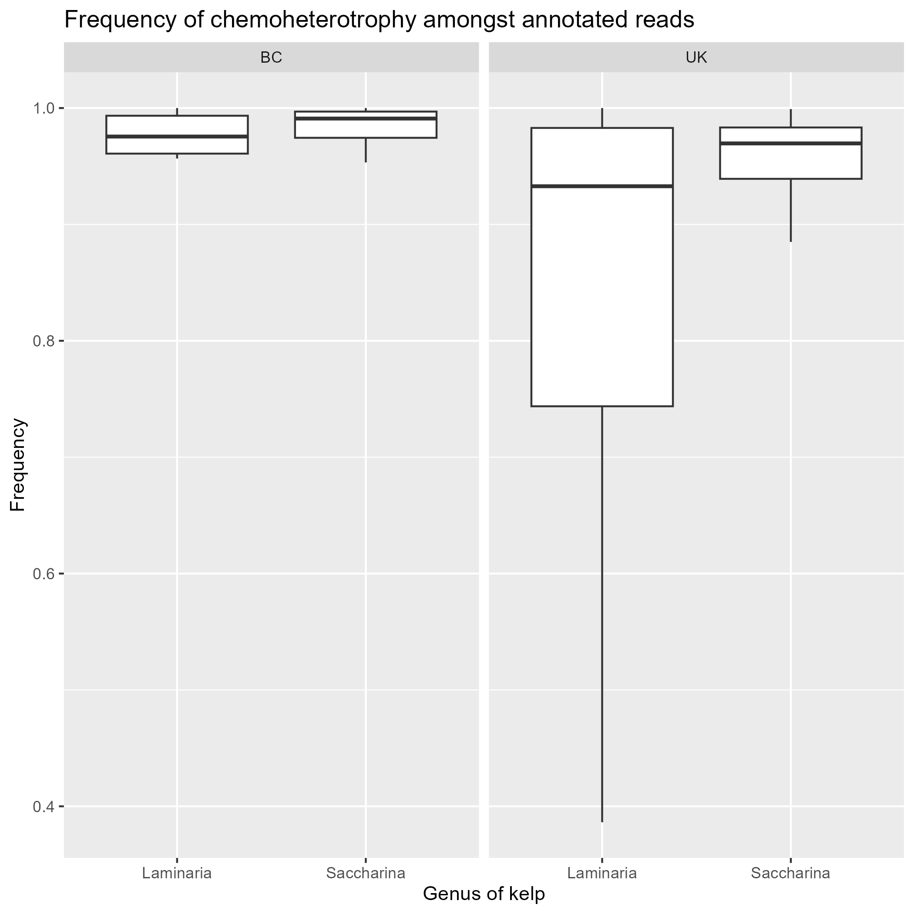
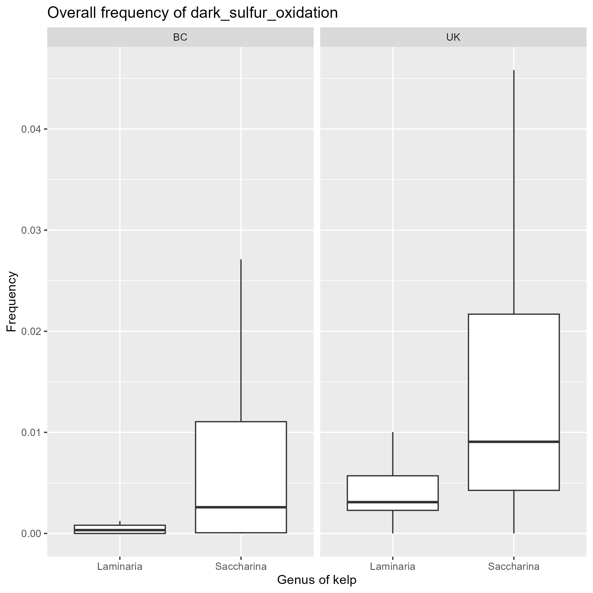
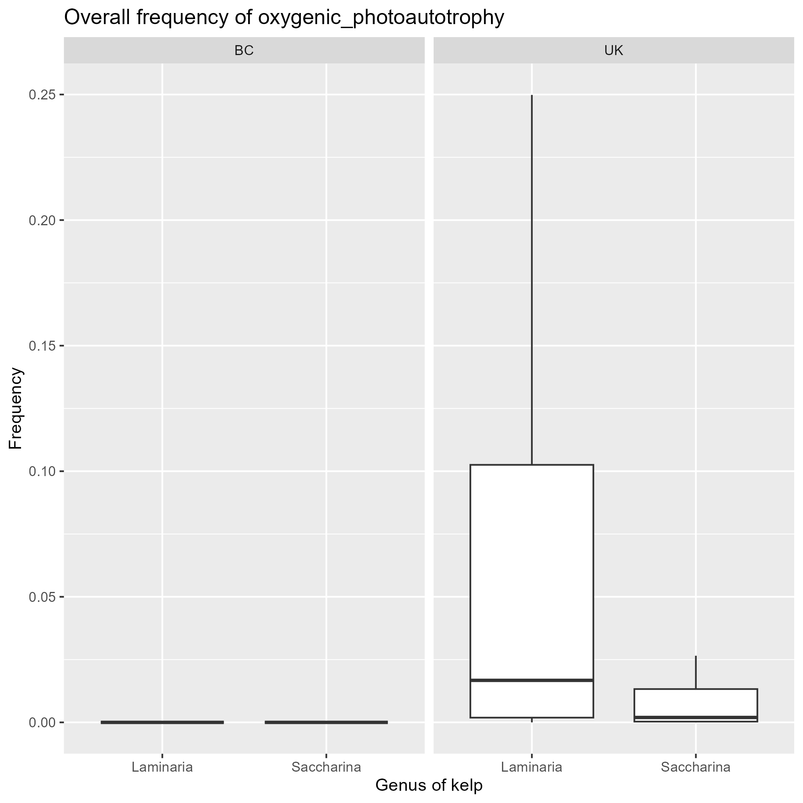

```{r setup, include=FALSE}
knitr::opts_chunk$set(echo = TRUE)
```

## Initialize necessary packages

```{r, message=FALSE}
## start by loading necessary packages

library(phyloseq)
library(tidyverse)
library(vegan)
library(plyr)
library(qualpalr)
library(ggpubr)
library(dplyr)
library(data.table)
library(biomformat)
library(readr)
```

## Clean data and combine datasets

First we will load in the data from Lemay et al. (2018). As a part of this we need to extract some metadata that is encoded in the sample names.

```{r}
lemay2018 <- readRDS("lemay2018_unfiltered_phyloseq.RDS")

newMeta = separate(as.data.frame(as.matrix(lemay2018@sam_data)), 
                              col="sample_id",
                              into=c("kelp_location", "number"),
                              sep="-")


newMeta$location = str_sub(newMeta$kelp_location, -2,-1)
newMeta$kelp= str_sub(newMeta$kelp_location, 1,-3)

lemay2018 = phyloseq(sample_data(newMeta),
                        otu_table(lemay2018@otu_table, taxa_are_rows = FALSE),
                        tax_table(lemay2018@tax_table))

## add a field to further specificy where the data was collected
lemay2018@sam_data$region = "BC"
```

Next we will import the data from King et al. (2022) and merge it with the Lemay data.

```{r}
## import king data
king2022 <- readRDS("king2022_unfiltered_phyloseq-2.RDS")

## add a variable to further specify where the data was collected
king2022@sam_data$region = "UK"

## merge with lemay data
kelp_me = merge_phyloseq(lemay2018, king2022)
```

Now we can clean our combined dataset

```{r}
kelp_me <- subset_taxa(kelp_me,
                       domain != "Unassigned" &
                         domain != "Eukaryota" &
                         order != "Chloroplast"&
                         order != "Mitochondria")
#Add unifiltered sample read numbers in 
kelp_me@sam_data$sample_sums_unfiltered <- as.numeric(sample_sums(kelp_me))
#sort(as.numeric(sample_sums(kelp_me))) : Most samples > 1000,
kelp_me_high <- prune_samples(sample_sums(kelp_me) >= 1000, kelp_me)
#extracting OTUs and filtering low frequency ASV's 
otutab <- as.data.frame((t(as.matrix(otu_table(kelp_me_high@otu_table)))))
otutab$asv_abundance <- rowSums(otutab)
#removing ASV's that occur fewer than 100 times in the dataset
otu.pruned <- subset(otutab, otutab$asv_abundance>100)
widthotu = ncol(otu.pruned)
otu.pruned <- otu.pruned[,-c(widthotu)]
#removing low freq samples 
ASVoccur = function(x){return(sum(x>0))}
otu.pruned$asv_occur_count = apply(otu.pruned,1, ASVoccur)
otu.highfreq = subset(otu.pruned, otu.pruned$asv_occur_count > 2)
otu.highfreq = otu.highfreq[,-c(widthotu)]
```

Finally we can de-noise and export this data for easy use in the future.

```{r}
## remove reads that are the result of sequencing errors
otu.clean <- mutate_all(otu.highfreq, funs(ifelse(. <5, 0, .)))

kelp_me_clean = phyloseq(sample_data(kelp_me_high),
                          tax_table(kelp_me_high),
                          otu_table(as.matrix(otu.clean), taxa_are_rows = TRUE))

kelp_me_clean@sam_data$sample_sums_filtered <- sample_sums(kelp_me_clean)

write_rds(kelp_me_clean, "kelp_me_clean.RDS")
```
## Import clean data

Import clean data, if necessary
```{r}
kelp_me_clean <- readRDS('kelp_me_clean.RDS')
```

## SKIP IF FAPROTAX HAS BEEN RUN: find functional classifications

Now we must save the OTU and taxonomy tables as dataframes and export them to the biom format.

```{r}
tax.data = as.data.frame(kelp_me_clean@tax_table)
tax.data = rownames_to_column(as.data.frame(tax.data))
otu.clean = as.data.frame(kelp_me_clean@otu_table)
names(tax.data)[1] = "OTUID"
otu_biom = make_biom(as.data.frame(otu.clean))
write_biom(otu_biom, "kelpme_otu.biom")
write.table(tax.data,"kelpme_otu_metadata.txt", quote = FALSE, sep ="\t")
```


Next we format our taxa metadata using python, using the following code. 

```tools.py -i kelpme_otu_metadata.txt -v```

After doing this we can add this metadata to our otu table using the following command line code:

```biom add-metadata -i kelpme_otu.biom -o kelpme_tax.biom --observation-metadata-fp kelpme_otu_metadata.txt```

Then we run collapse_table.py to get the proportions of different functions in our sample using this command line code:

``` collapse_table.py -i kelpme_tax.biom -o kelpme_func.biom -g FAPROTAX.txt --collapse_by_metadata "taxonomy" -v -s kelpme_sub_tables --out_groups2records_table kelpme_groups2records.txt --out_group_overlaps kelpme_overlaps.txt --omit_unrepresented_groups --group_leftovers_as "unannotated_asvs"```

Finally, we must transform our output into a text file to easily import it back into R using this last piece of command line code:

```biom convert -i kelpme_func.biom -o kelpme_func.txt --to-tsv```

## Import functional annotations into R

Then we can import this back into R as follows, and add it to our sample data.

```{r}
## import functional annotation of lemay dataset
file_name = "kelpme_func.txt"
func_table = read.table(file_name, sep = "\t", row.names = 1)
## import sample names and append them to the table of functional annotations
func_header = scan(file_name, nlines = 2, what = character())[-c(1:7)]
names(func_table) = func_header
func_table = as.data.frame(t(func_table))

metacols = ncol(func_table)
```

## Find number of ASVs in each sample that were annotated

To find the number of annotated ASVs in each sample we need to upload the annotation table from FAPROTAX and compare it to our OTU table.

```{r}
## use our counts of unannotated asv reads to find the number of annotated asv reads
func_table$annotated_asvs = kelp_me_clean@sam_data$sample_sums_filtered - func_table$unannotated_asvs
```

## Remove samples not from relevant kelp species

```{r}
## Combine the metadata from the original phyloseq file with the new functional annotation data
kelp_me_meta = as.data.frame(kelp_me_clean@sam_data)
func_table = cbind(func_table, kelp_me_meta)

func_table = subset(func_table, kelp == "Laminaria" | Species == "Laminaria hyperborea" | kelp == "Saccharina"| Species == "Saccharina latissima")
```


Now we will combine all these into a single table of functional annotations

```{r}
## combine the site names from the different datasets into a single column
func_table = unite(func_table, site, c(Site_name, location))

## before lengthening the table copy the number of annotated asvs to another column
func_table$annotated_asvs2 = func_table$annotated_asvs

## pivot longer to assign the occurence of each function to the sample it was measured in
func_table.long = func_table %>% pivot_longer(cols = c(1:metacols), names_to = "eco_function", values_to="function_abundance")


## calculate the relative abundance of each function in each sample
func_table.long$relative_abundance = func_table.long$function_abundance/func_table.long$sample_sums_filtered

## next summarise the data by function
func.sum = ddply(func_table.long, c("eco_function"), summarise, sum = sum(relative_abundance))

## sort the data by relative abundance
func.sum= func.sum[order(-func.sum$sum),]

## separate out the top 15 most common functions as well as the number of annotated reads in each sample
## the total number of annotated reads should be the most common "function" in each sample so we take the top 16 most common functions instead of the 15 most common
top.df = func.sum[c(1:17),]
top.df$place = "top_15"
```

## Plot the overall frequency of different functions

### Region

Next we will plot the relative abundances of the most common ecological functions on the West Coast and in the UK.

```{r}
for (f in top.df$eco_function){
  funcdata = subset(func_table.long, eco_function == f)
  funcy_plot = ggplot(funcdata, aes(x=as.character(region), y = as.numeric(relative_abundance)))+
    geom_boxplot(outliers=FALSE)+
    ggtitle(paste("Overall frequency of", f, sep = " "))+
    labs(y="Frequency", x="Region")
  ggsave(paste0(f,"_by_region",  ".png"), plot = funcy_plot, path = "figures/overall")
}
```
### Location

```{r}
for (f in top.df$eco_function){
  funcdata = subset(func_table.long, eco_function == f)
  funcy_plot = ggplot(funcdata, aes(x=as.character(site), y = as.numeric(relative_abundance)))+
    geom_point()+
    facet_grid(.~region, scales="free", space="free")+
    ggtitle(paste("Overall frequency of", f, sep = " "))+
    labs(y="Frequency", x="Location")
  ggsave(paste0(f,"_by_location",  ".png"), plot = funcy_plot, path = "figures/overall/data_by_location")
}
```

## Plot the frequency of different functions amongst annotated ASVs

When examining the most frequent functions in our samples we see an interesting trend where samples from the UK tend to have more annotated ASVs than samples from the West Coast.


To reduce this bias this we will calculate normalize relative frequency of the most common functions among the annotated ASVs by the number of annotated ASVs in a sample. Assuming that these are a representative sample of the overall functional profile of the population, this should help reduce this bias.

### Region

```{r}
func_table.long$relative_annotated_abundance = func_table.long$function_abundance/func_table.long$annotated_asvs2

for (f in top.df$eco_function){
  funcdata = subset(func_table.long, eco_function == f)
  funcy_plot = ggplot(funcdata, aes(x=as.character(region), y = as.numeric(relative_annotated_abundance)))+
    geom_boxplot(outliers=FALSE)+
    ggtitle(paste("Frequency of", f, "amongst annotated taxa", sep = " "))+
    labs(y="Frequency", x="Region")
  ggsave(paste0(f,"_by_region",  ".png"), plot = funcy_plot, path = "figures/annotated")
}
```

### Location

```{r}
for (f in top.df$eco_function){
  funcdata = subset(func_table.long, eco_function == f)
  funcy_plot = ggplot(funcdata, aes(x=as.character(site), y = as.numeric(relative_annotated_abundance)))+
    geom_point()+
    facet_grid(.~region, scales="free", space="free")+
    labs(y="Frequency", x="Location")+
    ggtitle(paste("Frequency of", f, "amongst annotated taxa", sep = " "))
  ggsave(paste0(f,"_by_location",  ".png"), plot = funcy_plot, path = "figures/annotated/data_by_location")
}
```

## Removing redundant functions

In our analysis it is now necessary to note that FAPROTAX classifies certain functions as nested within each other. For instance, all OTUs that were assigned aerobic chemoheterotrophy were also assigned chemoheterotrophy. In our results we can see this as several taxa have very similar frequencies to the taxa they are nested within.

 

Other examples of such nested phenotypes are:

- dark sulfur oxidation is nested in dark oxidation of sulfur compounds
- oxygenic photoautotrophy and photoautotrophy are nested in phototrophy

For further analysis then we will focus only on these nested functions as they provide the most specific information about the functional profile of these microbial communities. However, there are also functions which seem similar, both in their frequencies as well as their purposes, but are not nested within each another function. For instance:

 

as well as

 

We can now examine the overlaps tables for why this might be the case

```{r}
overlaps = read.table("kelpme_overlaps.txt", sep = "\t", row.names = 1, header = TRUE)

## first look at the overlap between dark sulfite and dark sulfur oxidation
print(overlaps["dark_sulfite_oxidation","dark_sulfur_oxidation"])

## next look at the overlap between photosynthetic cyanobacteria and oxygenic photoautotrophy
print(overlaps["photosynthetic_cyanobacteria","oxygenic_photoautotrophy"])
```

Then we can see that there is a total overlap between species assigned dark sulfite oxidation and dark sulfur oxidation, as well as between those assigned photosynthetic cyanobacteria and oxygenic photoautotrophy. We will then exclude dark sulfite oxidation and photosynthetic cyanobacteria from further analysis as they are redundant.

## A preliminary functional profile

Comparing the different functions present in our samples there is strong evidence for the presence of aerobic chemoheterotrophy across sites and samples. There is also some evidence for the presence of dark sulfur oxidation, oxygenic photoautotrophy, fermentation, and predation/parasitism (predatory_or_exoparasitic) at low levels in the UK.

     